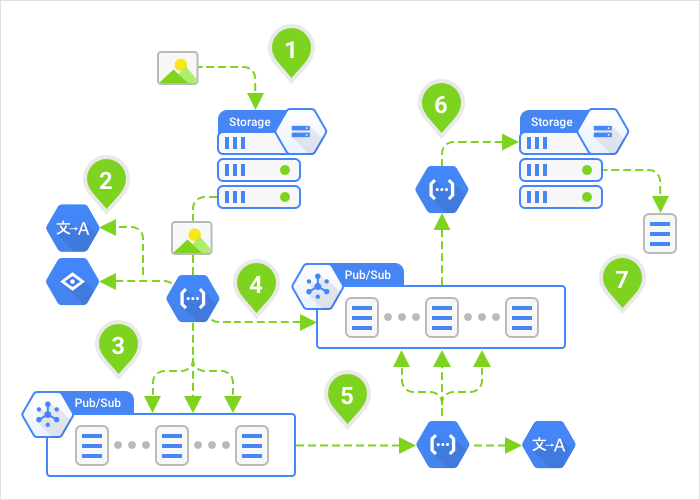

# Google Cloud Functions OCR sample

This recipe shows you how to use the Cloud Vision API together with the Google
Translate API using Cloud Pub/Sub as a message bus.

View the [source code][code].

[code]: index.js

## Overview

1. Image is uploaded to Cloud Storage with text in any language (text in the
image itself).
1. Cloud Function is triggered, uses the Vision API to extract the text, and the
Translate API to detect the language.
1. For all languages we're translating into (except the language of the text),
publish a message to ther *translate* topic.
1. For the language that matches the language of the text, bypass translation
and publish to the *save* topic.
1. Cloud Function is triggered and uses the Translate API to translate the
message into various languages, then publishes each translation to the *save*
topic.
1. Cloud Function is triggered and saves text to Cloud Storage.
1. Translated text from the original source image is downloaded.

## Deploy and Test

1. Follow the [Cloud Functions quickstart guide][quickstart] to setup Cloud
Functions for your project.

1. Enable the [Vision API][enable_vision] and the [Translate API][enable_translate].

1. Clone this repository:

        git clone https://github.com/GoogleCloudPlatform/nodejs-docs-samples.git
        cd nodejs-docs-samples/functions/ocr

1. [Create a Google Translate API Key][translate_api_key].

1. Create a file in the `app` folder called `config.json` with the following
contents:

        {
          "TRANSLATE_API_KEY": "[YOUR_API_KEY]",
          "RESULT_TOPIC": "[RESULT_TOPIC_NAME]",
          "RESULT_BUCKET": "[RESULT_BUCKET_NAME]",
          "TRANSLATE_TOPIC": "[TRANSLATE_TOPIC_NAME]",
          "TRANSLATE": true,
          "TO_LANG": ["en", "fr", "es", "ja", "ru"]
        }

    * Replace `[YOUR_API_KEY]` with your Translate API key.
    * Replace `[RESULT_TOPIC_NAME]` with a topic name used for saving results.
    * Replace `[RESULT_BUCKET_NAME]` with a bucket name used for saving results.
    * Replace `[TRANSLATE_TOPIC]` with a topic name used for translating results.

1. Deploy the `processImage` function with a GCS trigger:

        gcloud alpha functions deploy ocr-extract --bucket [YOUR_BUCKET_NAME] --trigger-gs-uri [YOUR_UPLOAD_BUCKET_NAME] --source app --entry-point processImage

    * Replace `[YOUR_BUCKET_NAME]` with the name of your staging Cloud Storage Bucket.
    * Replace `[YOUR_UPLOAD_BUCKET_NAME]` with the name of your Cloud Storage Bucket where you will be uploading images.

1. Deploy the `translateText` function with a Pub/Sub trigger:

        gcloud alpha functions deploy ocr-translate --bucket [YOUR_BUCKET_NAME] --trigger-topic [YOUR_TRANSLATE_TOPIC_NAME] --source app --entry-point translateText

    * Replace `[YOUR_BUCKET_NAME]` with the name of your staging Cloud Storage Bucket.
    * Replace `[YOUR_TRANSLATE_TOPIC_NAME]` with the name of your Pub/Sub topic with which translations will be triggered.

1. Deploy the `saveResult` function with a Pub/Sub trigger:

        gcloud alpha functions deploy ocr-save --bucket [YOUR_BUCKET_NAME] --trigger-topic [YOUR_RESULT_TOPIC_NAME] --source app --entry-point saveResult

    * Replace `[YOUR_BUCKET_NAME]` with the name of your staging Cloud Storage Bucket.
    * Replace `[YOUR_RESULT_TOPIC_NAME]` with the name of your Pub/Sub topic with which saving of results will be triggered.

1. Upload a sample image:

        gsutil cp images/menu.jpg gs://[YOUR_UPLOAD_BUCKET_NAME]

    * Replace `[YOUR_UPLOAD_BUCKET_NAME]` with the name of your Cloud Storage Bucket where you will be uploading images.

1. Watch the logs to make sure the executions have completed

        gcloud alpha functions get-logs --limit 100

1. Pull the extracted text from the bucket and pipe to standard out

        gsutil cat gs://[YOUR_RESULT_BUCKET_NAME]/menu_to_en.txt

    * Replace `[YOUR_RESULT_BUCKET_NAME]` with the name of your Cloud Storage Bucket where translated text will be saved.

[quickstart]: https://cloud.google.com/functions/quickstart
[enable_vision]: https://console.cloud.google.com/flows/enableapi?apiid=vision.googleapis.com&redirect=https://github.com/GoogleCloudPlatform/nodejs-docs-samples/tree/master/functions/ocr
[enable_translate]: https://console.cloud.google.com/flows/enableapi?apiid=translate&redirect=https://github.com/GoogleCloudPlatform/nodejs-docs-samples/tree/master/functions/ocr
[translate_api_key]: https://cloud.google.com/translate/v2/translating-text-with-rest#auth

