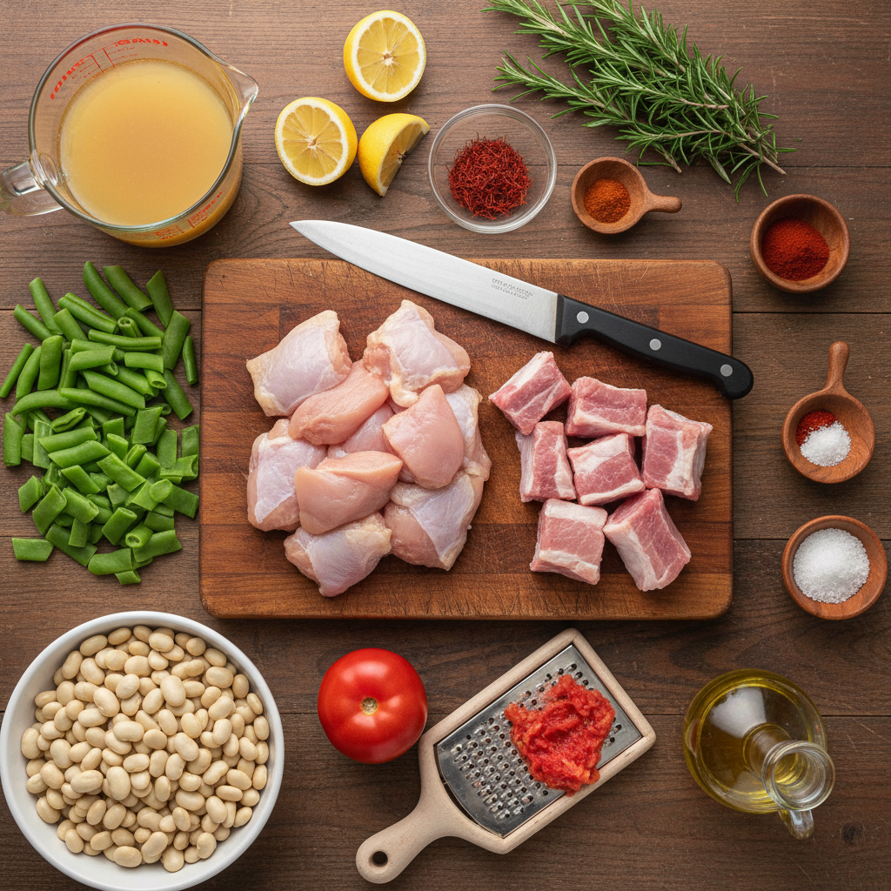
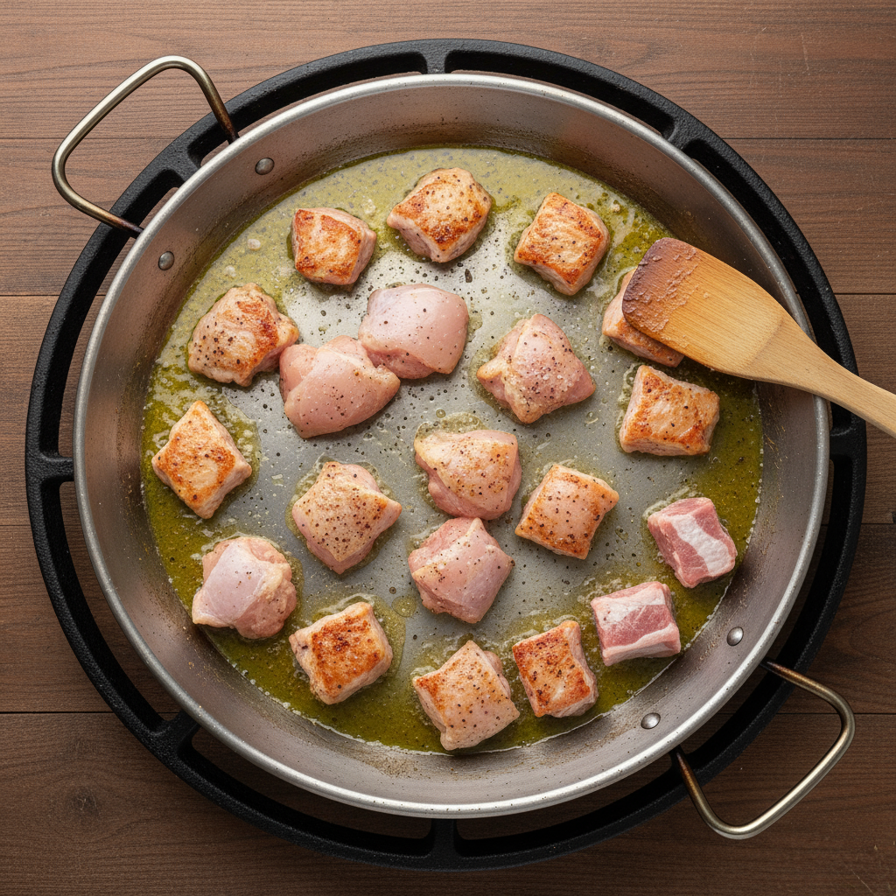
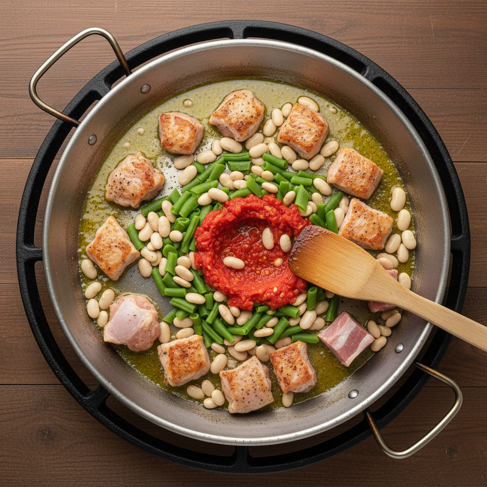

Let's cook some delicious paella! Here's an illustrated recipe for a classic Valencian paella.

## Illustrated Paella Recipe

### Ingredients:

*   4 cups short-grain rice (Bomba or Calasparra)
*   6 cups chicken or vegetable broth
*   1 lb boneless, skinless chicken thighs, cut into 1-inch pieces
*   1 lb rabbit or pork ribs (optional, traditional)
*   1/2 lb fresh green beans, trimmed and halved
*   1/2 lb large lima beans or butter beans (fresh or frozen)
*   1 large ripe tomato, grated or finely chopped
*   1/2 cup olive oil
*   1 tsp sweet paprika
*   Pinch of saffron threads, dissolved in a little warm broth
*   Salt and freshly ground black pepper
*   Fresh rosemary sprigs (for garnish, optional)
*   Lemon wedges (for serving)

### Equipment:

*   Paella pan (18-20 inches recommended)
*   Large cutting board
*   Sharp knife
*   Measuring cups and spoons

### Instructions:

**Step 1: Prepare Your Ingredients**

Gather all your ingredients and do your prep work. Cut the chicken and any other meats, chop your vegetables, and have your broth and spices ready. This makes the cooking process much smoother. 

**Step 2: Sauté the Meat**

Heat the olive oil in your paella pan over medium-high heat. Add the chicken and optional rabbit/pork. Season with salt and pepper. Brown the meat well on all sides, ensuring it's cooked through. This browning adds a lot of flavor to your paella. Once browned, push the meat to the sides of the pan. 

**Step 3: Add Vegetables**

Add the green beans and lima beans to the center of the pan. Sauté for about 5-7 minutes until they start to soften. Then, add the grated tomato and paprika. Cook for another 5 minutes, stirring occasionally, until the tomato breaks down and the mixture is fragrant. 

